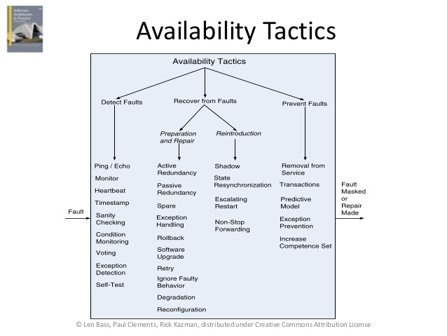

## Availability (가용성)
* 언제 어디서나 서비스나 자원을 제공해 줄 수 있는 시스템의 능력
* actions
  * 오류를 감춘다
  * 오류를 정정한다
  * 장애를 복구한다
* MTBF / MTBF + MTTR

* 참고
  * fault(오류) vs failure(장애)

* Tactics
  * 
  * 
    * Fault Detection
      - ping & echo
      - heartbeat
      - exception
    * Fault Recovery
      * Preparation & Repair
        - Voting
        - Active Redundancy
        - Passive Redundancy
        - Spare
      * Re-introduction
        * shadow operation
        * state resynchronization
        * checkpoint / rollback
    * Fault Prevention
      * removal from service
        * 아키텍쳐는 구성요소 재적재를 충분히 고려해야 한다
      * Transactions
        * 한번에 성공하거나 실패해야 할 일련의 단계를 묶어 놓은 것.
        * 데이터의 ACID 성질을 만족시킬 수 있다
      * Process Monitor